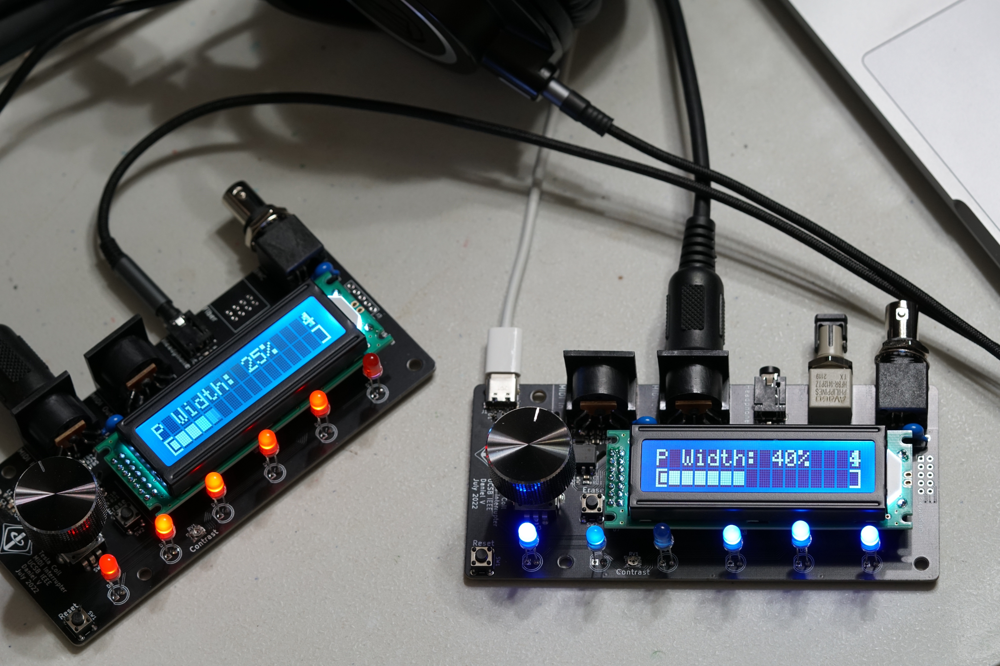

# UCSB IEEE Tesla Coil MIDI Synthesizer

This is the firmware and design files for a device to convert MIDI data to pulses to drive a Tesla Coil. It enumerates as a USB MIDI device and can be sent live play data or a recorded MIDI file.

The circuit board is based off of the [Arduino Due](https://docs.arduino.cc/hardware/due). It uses the similar SAM3A4C MCU, and has a fiber optic output for the big DRSSTC and a BNC port for the small Tesla Coil. It also has isolated physical MIDI in/out ports for connecting other instruments or daisy-chaining more MIDI interrupters. See [ucsbieee/ArduinoCore-SAM3A4C](https://github.com/ucsbieee/ArduinoCore-SAM3A4C) for an Arduino IDE board definition.

The device has six voices, which can each produce a single square wave tone at a variable duty cycle. They are ORed together to give a polyphonic effect.

## Uploading Firmware

New firmware can be uploaded using the Arduino IDE and the aforementioned [board definition](https://github.com/ucsbieee/ArduinoCore-SAM3A4C), or the [latest release](https://github.com/ucsbieee/Tesla-Coil-MIDI-Synth/releases/latest) (`.bin` file) can be uploaded using [BOSSA](https://github.com/shumatech/BOSSA) ([available from Homebrew](https://formulae.brew.sh/formula/bossa)).

### Arduino Library Dependencies
Available from the Arduino IDE library manager
 * [MIDIUSB](https://github.com/arduino-libraries/MIDIUSB)
 * [DueFlashStorage](https://github.com/sebnil/DueFlashStorage) (only if `SAVE_BASE_MIDI` is enabled, which it is not by default)

## Emulator

There is also an emulator that can be compiled to run on a normal computer so that songs can be developed without the physical hardware.

## MIDI Information

### MIDI Channels
 1. Clean (no effects)
 2. Effects
 3. Arpeggio and effects
 4. Drums

Standard MIDI pitch bend and aftertouch messages apply to all channels.

### Effects (CC number in parentheses)
 * Tremolo (rate = 102, depth = 92, delay = 103)
 * Vibrato (rate = 76, depth = 77, delay = 78)
 * ADSR (116, 117, 118, 119)
 * Arpeggio rate (14)

### Drum samples
 * Kick (36/C2)
 * Snare (40/E2)
 * Clap (39/D#2)
 * Tom (48/C3)
 * Closed hi-hat (42/F#2)
